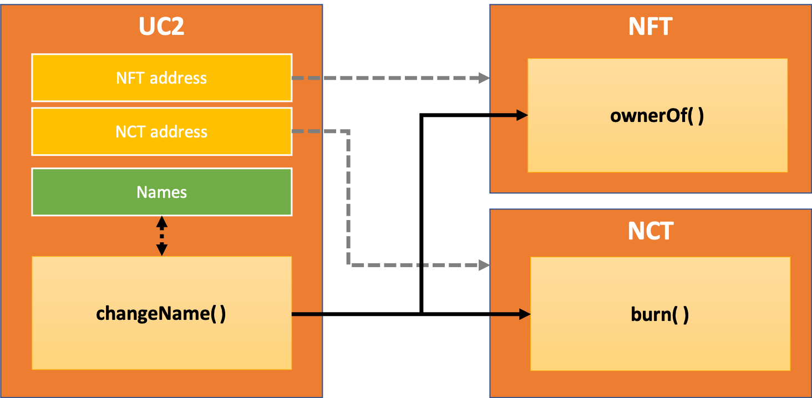

# NCT usage examples


This repository provides a concise and quick guide on how to integrate Name Changing Token (NCT) to a new or existing 
NFT project. The document is structured as follows:
- [Section 1](#s1) provides an introduction on NCTs illustrating what they are and their possible use-cases;
- [Section 2](#s2) explains how to integrate NCTs into an unpublished Ethereum smart contract in an embedded way;
- [Section 3](#s3) describes some possible solutions on how to integrate NCTs into a published Ethereum smart contract 
  project and is therefore no longer editable.

The repository is structured as follows:
- [contracts](./contracts): contracts implementation source code
- [test](./test): regression test
- [scripts](./scripts): deployment scripts

Building, testing and deployed instructions are available in [BUILDING.md](./BUILDING.md).

-----
Licence: MIT, see [LICENSE.md](./LICENSE.md)

Contacts: [simo@whaleanalytica.com](mailto:simo@whaleanalytica.com)

-----

## <a name="s1"></a> 1. What is NCT
The Name Change Token (NCT) is the native token of Hashmasks. The NCT has only one purpose: it allows its holder to 
give its Hashmask a unique name that is permanently stored and publicly visible on the Ethereum Blockchain. 
NCTs is the first ERC20 tokens to appear in the world of NFTs (birthday January 2021) and is used through a burn 
system to change the name of a Hashmasks.
As stated on The Hashmasks website, *"this opens up a whole new dimension for collecting where the hierarchy of the 
value of individual pieces of the entire collective art is highly influenced by consumer preferences."*

The address of the NCT contract is:  [0x8a9c4dfe8b9d8962b31e4e16f8321c44d48e246e](https://etherscan.io/token/0x8a9c4dfe8b9d8962b31e4e16f8321c44d48e246e) 

Each year, approximately 3,660 NCTs will be accumulated by each Hashmask. One needs 1,830 NCTs to change a Hashmasks’ name. 
In order to give early participants more decision power, each participant in the distribution period (14 days) received 
an additional 1,830 NCTs. After 10 years, the emission of new NCTs comes to a halt. From then on, NCTs can only be burnt 
until one day no NCTs are left and the names of the Hashmasks cannot be altered anymore. 
The artwork is then considered complete.

In summary:
- Number of NCTs emitted per year per NFT token: 3,660
- Number of NCTs required for one name change: 1,830
- Bonus NCTs for initial sales phase: 1,830

The rules for assigning a name to an NFT token are also followed in the implementation examples:
- No name can be identical
- There is a limit of 25 symbols (including spaces)
- Uniqueness is case insensitive (i.e. «John» and «john» are considered the same)
- There are no leading or trailing «spaces»
- Only alphanumeric symbols are eligible for use
- Used names become available immediately after the name of the NFT token was changed

## <a name="s2"></a> 2. Integrating a new NFT Project
This section discusses how to include NCT in a not-yet-deployed NFT contract thereby granting the ability to assign 
each NFTa name and charge for this functionality in NCT. A similar guide to this use case can be found 
[here](https://hackmd.io/@cgEsbYIST_6la5EYjGAJEg/rJB-ZKA_d).
This case can be solved with a single contract as shown in the image below. The contract in our example is called 
UC1 and it is the one implemented in [UC1.sol](./contracts/UC1.sol).


``UC1`` contains the map of names associated with each token. The ``changeName()`` function is used to change the name 
of an NFT token and imposes the following conditions:
- No two NFT tokens can have the same name.
- Only the owner of the NFT token can change the name.

In this example, the ``NAME_CHANGE_PRICE`` sets the NCT quantity  that must be burned to change the name. 
This policy can be changed to suit the needs of the project. 
Please remember that the number of decimal places in the NCT contract is 18.

It is important to note that for the operation to be successful, the owner of the token must:
- have enough NCTs in his wallet.
- call the ``increaseAllowance()`` function on the NCT contract before calling ``changeName()`` function, where as 
  parameters shall be given the address of the ``UC1`` contract and the number of NCT tokens to be approved.

In this example the json metadata of each token is dynamically created on-chain: 
see the function ``tokenURI()`` in [UC1.sol](./contracts/UC1.sol#L127) also reported herein below.
This implies that the name will be displayed automatically in NFTs exchanges like for example OpenSea. 
Please note that here, in order to simplify the example, the traits of each token are not handled.

 ```solidity
function tokenURI(uint256 tokenId) override public view returns (string memory) {
    require(_exists(tokenId),                 "TokenId not valid");
    require(bytes(_imagesRootURI).length > 0, "Image base URI not yet set");

    bytes memory dataURI = abi.encodePacked(
        '{',
            '"name": "', tokenNameByIndex(tokenId),'",',
            '"description": "your project description",',
            '"image": "', string(abi.encodePacked(_baseURI(), tokenId.toString())),
         '"}'
    );

    return string(
        abi.encodePacked(
            "data:application/json;base64,",
            Base64.encode(dataURI)
        )
    );
}
 ```

## <a name="s3"></a> 3. Integrating into an existing NFT project
This section describes how to develop a parallel contract for an  Ethereum Mainnet deployed NFT contract that can be 
used to add naming functionality to NFTs. This example consists of 3 contracts: 
1. Original NFT already deployed, 
2. NCT already deployed, and
3. UC2 which is the contract used to manage the NFTs’ names in the contract. 

The contract in our UC2 example is the one implemented in [UC2.sol](./contracts/UC2.sol).



``UC2`` contains the map of names associated with each NFT token and uses the ``changeName()`` function to change the 
NFT token names’ name to a token while imposing the following conditions:
- No two tokens can have the same name
- Only the owner of the token can change the name: guaranteed by making the “ownerOf” query to the NFT contract

In this example, the ``NAME_CHANGE_PRICE`` sets the NCT quantity  that must be burned to change the name.
This policy can be changed to suit the needs of the project. 
Please remember that the number of decimal places in the NCT contract is 18.


It is important to note that for the operation to be successful, the owner of the token must:
- have enough NCTs in his wallet.
- call the ``increaseAllowance()`` function on the NCT contract before calling ``changeName()`` function, 
  where as parameters shall be given the address
  of the ``UC2`` contract and the number of NCT tokens to be approved.


